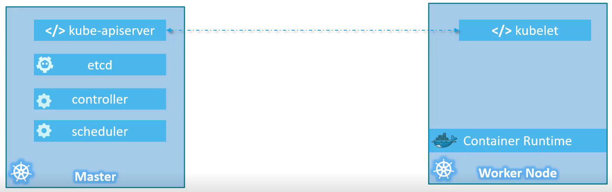
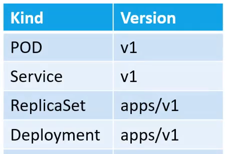
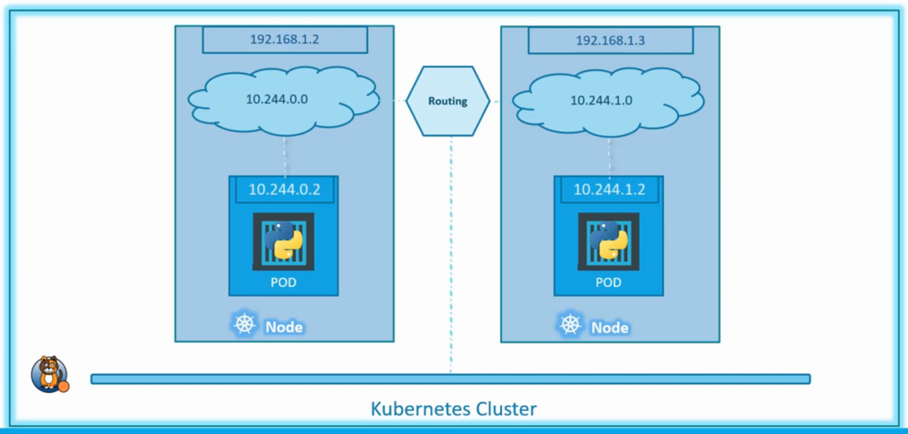
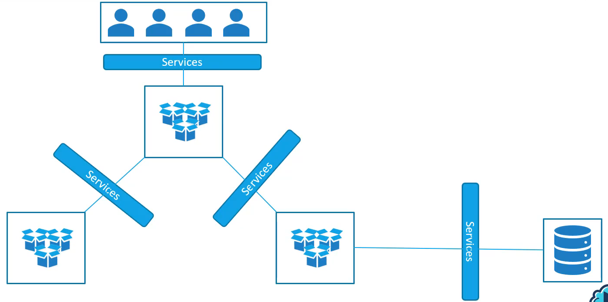
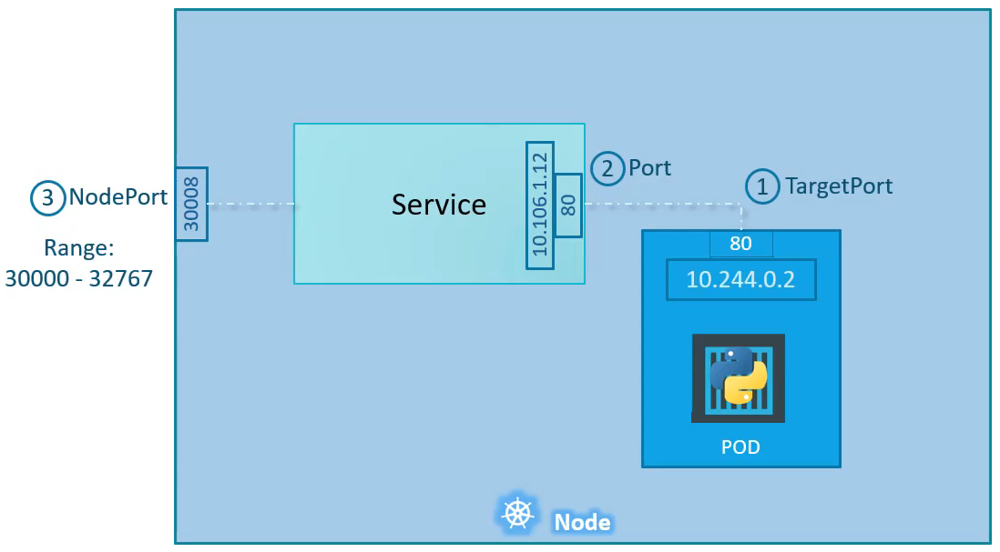
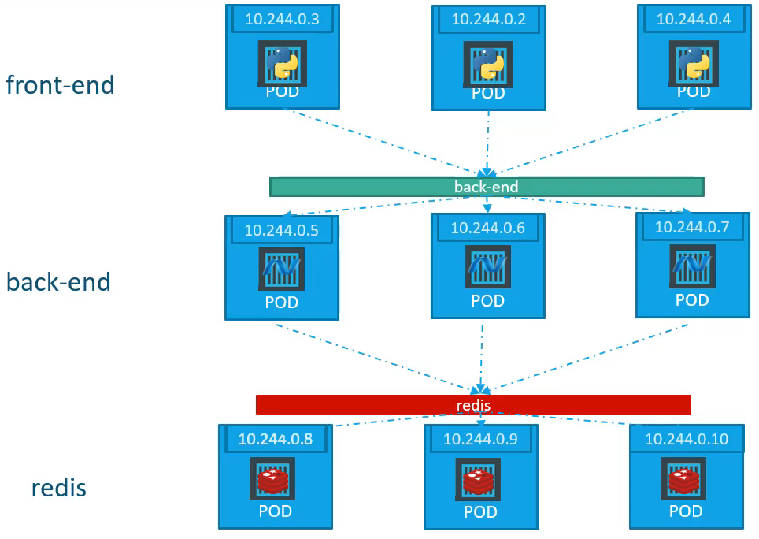
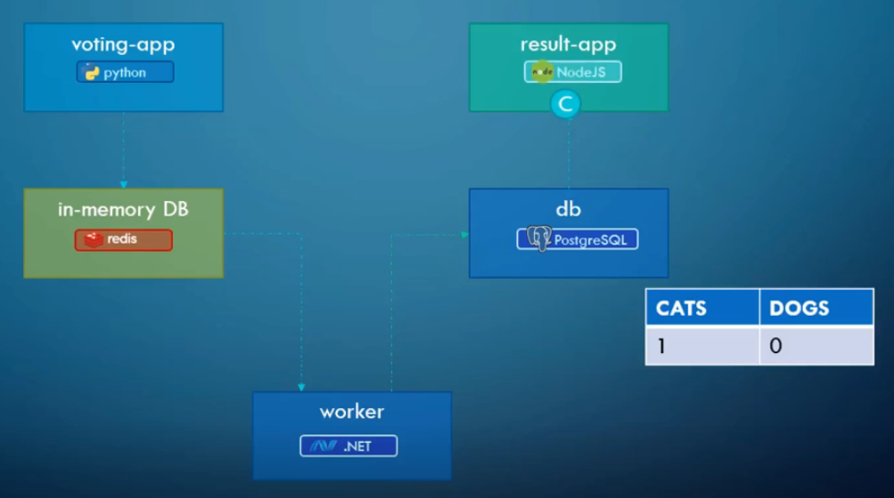

# Notes

<!-- vim-markdown-toc GFM -->

* [Introduction](#introduction)
    * [Terms](#terms)
    * [Components](#components)
* [Setup](#setup)
    * [Kubectl](#kubectl)
    * [Minikube](#minikube)
* [PODS](#pods)
    * [YAML](#yaml)
* [Replication Controller & Replica Set](#replication-controller--replica-set)
    * [Scaling](#scaling)
* [Deployments](#deployments)
    * [Rollout & Versioning](#rollout--versioning)
    * [Summary](#summary)
* [Networking](#networking)
* [Services](#services)
    * [Types](#types)
    * [NodePort Service](#nodeport-service)
    * [ClusterIP Service](#clusterip-service)
* [Microservices Example (Play With k8s)](#microservices-example-play-with-k8s)

<!-- vim-markdown-toc -->

## Introduction

### Terms

- **Nodes (Minions)**: Physical/ Virtual machines on which k8s will run containers.
- **Cluster**: Set of nodes for protection from node failure
- **Master Node**: Controls orchestration on worker nodes

### Components

- **API Server**: Front end for K8s cluster
- **etcd**: Distributed (stores on all nodes), reliable K-V store
- **Scheduler**: Work distribution, assigns containers to nodes
- **Controller**: Brains; Monitoring, re-spawning etc.
- **Container Runtime**: Docker
- **Kubelet**: Agent on nodes



## Setup

### Kubectl

Command line tool for managing k8s cluster

### Minikube

Install minikube and follow instructions at https://kubernetes.io/docs/setup/learning-environment/minikube/ (Changed to https://minikube.sigs.k8s.io/docs/start/)

Might look something like:

```
❯ minikube start
## Lots of progress logs with emojis
❯ kubectl create deployment hello-minikube --image=k8s.gcr.io/echoserver:1.10
deployment.apps/hello-minikube created
❯ kubectl expose deployment hello-minikube --type=NodePort --port=8080
service/hello-minikube exposed
❯ kubectl get pod
NAME                              READY   STATUS    RESTARTS   AGE
hello-minikube-5d9b964bfb-5fzll   1/1     Running   0          55s
❯ minikube service hello-minikube --url
http://172.17.0.2:30105
❯ minikube dashboard
## Starts and launches K8s dashboard
❯ minikube service list
|----------------------|---------------------------|--------------|-------------------------|
|      NAMESPACE       |           NAME            | TARGET PORT  |           URL           |
|----------------------|---------------------------|--------------|-------------------------|
| default              | hello-minikube            |         8080 | http://172.17.0.2:30105 |
| default              | kubernetes                | No node port |
| kube-system          | kube-dns                  | No node port |
| kubernetes-dashboard | dashboard-metrics-scraper | No node port |
| kubernetes-dashboard | kubernetes-dashboard      | No node port |
|----------------------|---------------------------|--------------|-------------------------|
```

## PODS

- Smallest object that can be created in K8s
- Represents single instance of application
- one to one relationship with container (of one kind)
- pods are added/removed for scaling
- pod can have multiple containers required for an application (but rarely)

```
❯ kubectl run nginx --image nginx
pod/nginx created

❯ kubectl get pod
NAME                              READY   STATUS              RESTARTS   AGE
hello-minikube-5d9b964bfb-5fzll   1/1     Running             1          22d
nginx                             0/1     ContainerCreating   0          17s

❯ kubectl get pods -o wide
NAME                              READY   STATUS    RESTARTS   AGE     IP           NODE       NOMINATED NODE   READINESS GATES
hello-minikube-5d9b964bfb-5fzll   1/1     Running   1          22d     172.18.0.3   minikube   <none>           <none>
nginx                             1/1     Running   0          7m45s   172.18.0.6   minikube   <none>           <none>

❯ kubectl describe pods
Name:         hello-minikube-5d9b964bfb-5fzll
Namespace:    default
Priority:     0
Node:         minikube/172.17.0.2
Start Time:   Mon, 28 Sep 2020 14:30:07 +0530
Labels:       app=hello-minikube
              pod-template-hash=5d9b964bfb
Annotations:  <none>
Status:       Running
IP:           172.18.0.3
IPs:
  IP:           172.18.0.3
Controlled By:  ReplicaSet/hello-minikube-5d9b964bfb
Containers:
  echoserver:
    Container ID:   docker://c88459986c70fd52157834386c264d3ea6ff4af82f27386c4b698b12c5d44ea2
    Image:          k8s.gcr.io/echoserver:1.10
    Image ID:       docker-pullable://k8s.gcr.io/echoserver@sha256:cb5c1bddd1b5665e1867a7fa1b5fa843a47ee433bbb75d4293888b71def53229
    Port:           <none>
    Host Port:      <none>
    State:          Running
      Started:      Tue, 20 Oct 2020 14:54:35 +0530
    Last State:     Terminated
      Reason:       Error
      Exit Code:    255
      Started:      Mon, 28 Sep 2020 14:30:28 +0530
      Finished:     Tue, 20 Oct 2020 14:53:27 +0530
    Ready:          True
    Restart Count:  1
    Environment:    <none>
    Mounts:
      /var/run/secrets/kubernetes.io/serviceaccount from default-token-9rf6b (ro)
Conditions:
  Type              Status
  Initialized       True
  Ready             True
  ContainersReady   True
  PodScheduled      True
Volumes:
  default-token-9rf6b:
    Type:        Secret (a volume populated by a Secret)
    SecretName:  default-token-9rf6b
    Optional:    false
QoS Class:       BestEffort
Node-Selectors:  <none>
Tolerations:     node.kubernetes.io/not-ready:NoExecute op=Exists for 300s
                 node.kubernetes.io/unreachable:NoExecute op=Exists for 300s
Events:
  Type    Reason          Age   From     Message
  ----    ------          ----  ----     -------
  Normal  SandboxChanged  38m   kubelet  Pod sandbox changed, it will be killed and re-created.
  Normal  Pulled          38m   kubelet  Container image "k8s.gcr.io/echoserver:1.10" already present on machine
  Normal  Created         38m   kubelet  Created container echoserver
  Normal  Started         38m   kubelet  Started container echoserver


Name:         nginx
Namespace:    default
Priority:     0
Node:         minikube/172.17.0.2
Start Time:   Tue, 20 Oct 2020 15:30:47 +0530
Labels:       run=nginx
Annotations:  <none>
Status:       Running
IP:           172.18.0.6
IPs:
  IP:  172.18.0.6
Containers:
  nginx:
    Container ID:   docker://bb7250277ae3e10f1fcbe2de5a96adccfb42b2dc1c753bed70968dfaa283737a
    Image:          nginx
    Image ID:       docker-pullable://nginx@sha256:ed7f815851b5299f616220a63edac69a4cc200e7f536a56e421988da82e44ed8
    Port:           <none>
    Host Port:      <none>
    State:          Running
      Started:      Tue, 20 Oct 2020 15:31:21 +0530
    Ready:          True
    Restart Count:  0
    Environment:    <none>
    Mounts:
      /var/run/secrets/kubernetes.io/serviceaccount from default-token-9rf6b (ro)
Conditions:
  Type              Status
  Initialized       True
  Ready             True
  ContainersReady   True
  PodScheduled      True
Volumes:
  default-token-9rf6b:
    Type:        Secret (a volume populated by a Secret)
    SecretName:  default-token-9rf6b
    Optional:    false
QoS Class:       BestEffort
Node-Selectors:  <none>
Tolerations:     node.kubernetes.io/not-ready:NoExecute op=Exists for 300s
                 node.kubernetes.io/unreachable:NoExecute op=Exists for 300s
Events:
  Type    Reason     Age   From               Message
  ----    ------     ----  ----               -------
  Normal  Scheduled  110s  default-scheduler  Successfully assigned default/nginx to minikube
  Normal  Pulling    107s  kubelet            Pulling image "nginx"
  Normal  Pulled     79s   kubelet            Successfully pulled image "nginx" in 28.214212888s
  Normal  Created    77s   kubelet            Created container nginx
  Normal  Started    76s   kubelet            Started container nginx

```

### YAML



pod-definition.yaml

```yaml
# 4 top level properties are required for all objects
apiVersion: v1   		# Depends on api version of kind
kind: Pod        		# Kind of definition
metadata:        		# Data about the object
  name: myapp-pod
  labels:
    app: myapp
    type: front-end
spec:            		# Information pertaining to the object
  containers:
    - name: nginx-container
      image: nginx
```

```
❯ kubectl create -f pod-definition.yml
pod/myapp-pod created
❯ kubectl get pods
NAME                              READY   STATUS              RESTARTS   AGE
hello-minikube-5d9b964bfb-5fzll   1/1     Running             1          22d
myapp-pod                         0/1     ContainerCreating   0          3s
nginx                             1/1     Running             0          30m
```

## Replication Controller & Replica Set

- Helps run multiple instances, providing **high availability**
- Automatically brings up another pod if one fails
- Spawn new nodes when resource usage full, providing **load balancing and scaling**
- Replica set preferred over replication controller
  - Replica set requires selector in spec, used to identify and link any existing running containers
- Docs: https://kubernetes.io/docs/concepts/workloads/controllers/replicaset/

```yaml
# replicaset-definition.yaml
apiVersion: apps/v1 # For RC: v1
kind: ReplicaSet # For RC: ReplicationController
metadata:
  name: myapp-replicaset # For RC: myapp-rc
  labels:
    app: myapp
    type: front-end
spec:
  template: # Everything from pod-definition except apiVersion & kind
    metadata:
      name: myapp-pod
      labels:
        app: myapp
        type: front-end
    spec:
      containers:
        - name: nginx-container
          image: nginx
  replicas: 3
  selector: # Supported but not required in case of replication controller
    matchLabels:
     type: front-end
```

```
############ Creating replication controller

❯ kubectl create -f rc-definition.yml
replicationcontroller/myapp-rc created
❯ kubectl get replicationcontroller
NAME       DESIRED   CURRENT   READY   AGE
myapp-rc   3         3         2       21s
❯ kubectl get pods
NAME                              READY   STATUS    RESTARTS   AGE
hello-minikube-5d9b964bfb-5fzll   1/1     Running   1          22d
myapp-pod                         1/1     Running   0          76s
myapp-rc-5pbfj                    1/1     Running   0          29s
myapp-rc-cvk9g                    1/1     Running   0          29s
myapp-rc-wf5x5                    1/1     Running   0          29s
nginx                             1/1     Running   0          36m

############ Deleting replication controller

❯ kubectl delete replicationcontroller myapp-rc
replicationcontroller "myapp-rc" deleted
❯ kubectl get pods
NAME                              READY   STATUS        RESTARTS   AGE
hello-minikube-5d9b964bfb-5fzll   1/1     Running       1          22d
myapp-pod                         1/1     Running       0          6m1s
myapp-rc-5pbfj                    1/1     Terminating   0          4m45s
myapp-rc-cvk9g                    1/1     Terminating   0          4m45s
myapp-rc-wf5x5                    1/1     Terminating   0          4m45s
nginx                             1/1     Running       0          40m

############ Creating replica set

❯ kubectl create -f replicaset-definition.yml
replicaset.apps/myapp-rc created
❯ kubectl get pods
NAME                              READY   STATUS              RESTARTS   AGE
hello-minikube-5d9b964bfb-5fzll   1/1     Running             1          22d
myapp-pod                         1/1     Running             0          9m5s
myapp-rc-6pdcn                    0/1     ContainerCreating   0          3s
myapp-rc-t7lm6                    0/1     ContainerCreating   0          3s
nginx                             1/1     Running             0          45m
# Notice only 2 more pods started

############ Seeing replica sets

❯ kubectl get replicaset
NAME                        DESIRED   CURRENT   READY   AGE
hello-minikube-5d9b964bfb   1         1         1       22d
myapp-rc                    3         3         3       14m
❯ kubectl get rs
NAME                        DESIRED   CURRENT   READY   AGE
hello-minikube-5d9b964bfb   1         1         1       22d
myapp-rc                    3         3         3       18m

############ Deleting a pod of replica set: Another is spawned instantly

❯ kubectl delete pod myapp-rc-6pdcn
pod "myapp-rc-6pdcn" deleted
❯ kubectl get pods
NAME                              READY   STATUS              RESTARTS   AGE
hello-minikube-5d9b964bfb-5fzll   1/1     Running             1          22d
myapp-pod                         1/1     Running             0          126m
myapp-rc-6pdcn                    0/1     Terminating         0          122m
myapp-rc-b4lrg                    0/1     ContainerCreating   0          17s
myapp-rc-t7lm6                    1/1     Running             0          122m
nginx                             1/1     Running             0          168m
❯ kubectl get pods
NAME                              READY   STATUS    RESTARTS   AGE
hello-minikube-5d9b964bfb-5fzll   1/1     Running   1          22d
myapp-pod                         1/1     Running   0          126m
myapp-rc-b4lrg                    1/1     Running   0          22s
myapp-rc-t7lm6                    1/1     Running   0          122m
nginx                             1/1     Running   0          168m

############ Attempting to create more nodes than replication: Gets terminated

❯ kubectl create -f pod-definition.yml
pod/myapp-pod created
❯ kubectl get pods
NAME                              READY   STATUS        RESTARTS   AGE
hello-minikube-5d9b964bfb-5fzll   1/1     Running       1          22d
myapp-pod                         0/1     Terminating   0          4s
myapp-rc-5hzqg                    1/1     Running       0          10m
myapp-rc-b4lrg                    1/1     Running       0          13m
myapp-rc-t7lm6                    1/1     Running       0          136m
nginx                             1/1     Running       0          3h1m
```

### Scaling

Way 1:

1. Update `replicas` parameter in yml

2. ```
   ❯ kubectl replace -f replicaset-definition.yml
   ```

Way 2:

1. Overrides replicas parameter but doesn't change file

   ```
   ❯ kubectl scale --replicas=6 -f replicaset-definition.yml
   ```

Way 3:

1. Scale by name

   ```
   ❯ kubectl scale --replicas=6 replicaset myapp-replicaset
   ```

TODO: Scaling automatically based on load

## Deployments

- Rolling application updates
- Rolling environment changes (Pause & resume, so that rolled out together for all pods)
- Rollback if update breaks something
- Deployment = Replica set + these capabilities

```yaml
# deployment-definition.yaml
# Same as replicaset, except kind: Deployment
apiVersion: apps/v1 # For RC: v1
kind: Deployment
metadata:
  name: myapp-deployment
  labels:
    app: myapp
    type: front-end
spec:
  template: # Everything from pod-definition except apiVersion & kind
    metadata:
      name: myapp-pod
      labels:
        app: myapp
        type: front-end
    spec:
      containers:
        - name: nginx-container
          image: nginx
  replicas: 3
  selector:
    matchLabels:
     type: front-end
```

```
############ Creating deployment

❯ kubectl get pods
NAME                              READY   STATUS              RESTARTS   AGE
hello-minikube-5d9b964bfb-5fzll   1/1     Running             1          22d
myapp-pod                         0/1     ContainerCreating   0          2s
nginx                             1/1     Running             0          3h20m
❯ kubectl create -f deployment-definition.yml
deployment.apps/myapp-deployment created
❯ kubectl get pods
NAME                                READY   STATUS              RESTARTS   AGE
hello-minikube-5d9b964bfb-5fzll     1/1     Running             1          22d
myapp-deployment-7df67f74c5-pm82x   0/1     ContainerCreating   0          2s
myapp-deployment-7df67f74c5-r46zj   0/1     ContainerCreating   0          2s
myapp-deployment-7df67f74c5-sl5vl   0/1     ContainerCreating   0          2s
myapp-pod                           1/1     Running             0          109s
nginx                               1/1     Running             0          3h22m

# Note that existing pod is not taken into the deployment, as was the case for raplica set

############ Seeing deployments

❯ kubectl get deployments
NAME               READY   UP-TO-DATE   AVAILABLE   AGE
hello-minikube     1/1     1            1           22d
myapp-deployment   3/3     3            3           3m16s
❯ kubectl get replicasets
NAME                          DESIRED   CURRENT   READY   AGE
hello-minikube-5d9b964bfb     1         1         1       22d
myapp-deployment-7df67f74c5   3         3         3       3m21s

# Note that deployment creates a replica set

############ Seeing everything

❯ kubectl get all
NAME                                    READY   STATUS    RESTARTS   AGE
pod/hello-minikube-5d9b964bfb-5fzll     1/1     Running   1          22d
pod/myapp-deployment-7df67f74c5-pm82x   1/1     Running   0          5m25s
pod/myapp-deployment-7df67f74c5-r46zj   1/1     Running   0          5m25s
pod/myapp-deployment-7df67f74c5-sl5vl   1/1     Running   0          5m25s
pod/myapp-pod                           1/1     Running   0          7m12s
pod/nginx                               1/1     Running   0          3h27m

NAME                     TYPE        CLUSTER-IP       EXTERNAL-IP   PORT(S)          AGE
service/hello-minikube   NodePort    10.111.177.148   <none>        8080:30105/TCP   22d
service/kubernetes       ClusterIP   10.96.0.1        <none>        443/TCP          23d

NAME                               READY   UP-TO-DATE   AVAILABLE   AGE
deployment.apps/hello-minikube     1/1     1            1           22d
deployment.apps/myapp-deployment   3/3     3            3           5m26s

NAME                                          DESIRED   CURRENT   READY   AGE
replicaset.apps/hello-minikube-5d9b964bfb     1         1         1       22d
replicaset.apps/myapp-deployment-7df67f74c5   3         3         3       5m25s
```

### Rollout & Versioning

- Rollouts are versioned to allow for reverting to previous versions
- Rolling update is default deployment strategy
  - Recreate (all down then all up) needs to be specified explicitly
- Ways of triggering rollout:
  - Edit yml and run `kubectl apply -f deployment-definition.yml`
  - Change image using `kubectl set image deployment/myapp-deployment nginx=nginx:1.9.1 `
- For rolling, new replica set is created, and old replica set is scaled down one pod at a time as pods in new replica set get created
- For rollback, undo can be used

```
############ Checking history

❯ kubectl rollout history deployments/myapp-deployment
deployment.apps/myapp-deployment
REVISION  CHANGE-CAUSE
2         kubectl apply --filename=deployment-definition.yml --record=true
3         kubectl set image deployment/myapp-deployment nginx-container=nginx --record=true

############ New deployment updating container that doesn't exist: Gets stuck, old replica set stays active

❯ kubectl set image deployment/myapp-deployment nginx-container=nginx:boom --record
deployment.apps/myapp-deployment image updated
❯ kubectl rollout status deployment/myapp-deployment
Waiting for deployment "myapp-deployment" rollout to finish: 1 out of 3 new replicas have been updated...
^C%                                                                                       ❯ kubectl get pods
NAME                                READY   STATUS         RESTARTS   AGE
hello-minikube-5d9b964bfb-5fzll     1/1     Running        1          22d
myapp-deployment-6f8f5ffc78-dx458   0/1     ErrImagePull   0          68s
myapp-deployment-7df67f74c5-ddv68   1/1     Running        0          5m8s
myapp-deployment-7df67f74c5-ngzst   1/1     Running        0          5m19s
myapp-deployment-7df67f74c5-vhclh   1/1     Running        0          4m58s
myapp-pod                           1/1     Running        0          114m
nginx                               1/1     Running        0          5h14m
❯ kubectl rollout history deployments/myapp-deployment
deployment.apps/myapp-deployment
REVISION  CHANGE-CAUSE
2         kubectl apply --filename=deployment-definition.yml --record=true
3         kubectl set image deployment/myapp-deployment nginx-container=nginx --record=true
4         kubectl set image deployment/myapp-deployment nginx-container=nginx:boom --record=true
❯ kubectl rollout status deployment/myapp-deployment
Waiting for deployment "myapp-deployment" rollout to finish: 1 out of 3 new replicas have been updated...
^C%
############ Rolling back deployment

❯ kubectl rollout undo deployments/myapp-deployment
deployment.apps/myapp-deployment rolled back
❯ kubectl rollout status deployment/myapp-deployment
deployment "myapp-deployment" successfully rolled out
❯ kubectl rollout history deployments/myapp-deployment
deployment.apps/myapp-deployment
REVISION  CHANGE-CAUSE
2         kubectl apply --filename=deployment-definition.yml --record=true
4         kubectl set image deployment/myapp-deployment nginx-container=nginx:boom --record=true
5         kubectl set image deployment/myapp-deployment nginx-container=nginx --record=true
```

### Summary

```
Create:   kubectl create -f deployment-definition.yml --save-config --record
Get:      kubectl get deployments
Update:   kubectl apply -f deployment-definition.yml --record
          kubectl set image deployment/myapp-deployment nginx=nginx:1.9.1 --record
Status:   kubectl rollout status deployment/myapp-deployment
          kubectl rollout history deployment/myapp-deployment
Rollback: kubectl rollout undo deployment/myapp-deployment
```

## Networking

- Node IP address
- Local network created by default for node (10.244.0.0 ?)
  - Each pod assigned IP address from this
- For cluster, networking needs to be configured
  - [K8s Network Model](https://kubernetes.io/docs/concepts/cluster-administration/networking/#the-kubernetes-network-model): Pod to pod and node to pod and pod to node, all should be possible without NAT
  - [Tools](https://kubernetes.io/docs/concepts/cluster-administration/networking/#how-to-implement-the-kubernetes-networking-model) like calico, flannel, cisco etc. can be used for this



## Services

- K8s component mainly used for communication



### [Types](https://kubernetes.io/docs/concepts/services-networking/service/#publishing-services-service-types)

- ClusterIP: Virtual IPs for communication inside node
- NodePort: Exposes cluster IP on a node port
- LoadBalancer: Exposes nodeport using cloud provider's load balancer
- [ExternalName](https://akomljen.com/kubernetes-tips-part-1/): Maps service to DNS name (CNAME)

### NodePort Service



```yaml
# service-definition.yml
apiVersion: v1
kind: Service
metadata:
  name: myapp-service
spec:
  type: NodePort
  ports:
    - port: 80 			# Only required field
      targetPort: 80    # Same as port if not specified
      nodePort: 30008   # Free port in range would be allocated if not specified
  selector:
    app: myapp
    type: front-end
```

Selector can lead to some special Scenarios:

- Multiple pods in single node: Automatically load balanced (by default using random algorithm supporting sticky sessions)
- Multiple pods in multiple nodes: Automatically creates service spanning nodes, applying same port forwarding on each node

```
❯ kubectl create -f service-definition.yml --record
service/myapp-service created
❯ kubectl get services
NAME             TYPE        CLUSTER-IP       EXTERNAL-IP   PORT(S)          AGE
hello-minikube   NodePort    10.111.177.148   <none>        8080:30105/TCP   22d
kubernetes       ClusterIP   10.96.0.1        <none>        443/TCP          23d
myapp-service    NodePort    10.107.107.39    <none>        80:30008/TCP     11s
❯ curl -i $(minikube ip):30008
HTTP/1.1 200 OK
Server: nginx/1.19.3
Date: Tue, 20 Oct 2020 16:45:48 GMT
Content-Type: text/html
Content-Length: 612
Last-Modified: Tue, 29 Sep 2020 14:12:31 GMT
Connection: keep-alive
ETag: "5f7340cf-264"
Accept-Ranges: bytes

<!DOCTYPE html>
<html>
<head>
<title>Welcome to nginx!</title>
<style>
    body {
        width: 35em;
        margin: 0 auto;
        font-family: Tahoma, Verdana, Arial, sans-serif;
    }
</style>
</head>
<body>
<h1>Welcome to nginx!</h1>
<p>If you see this page, the nginx web server is successfully installed and
working. Further configuration is required.</p>

<p>For online documentation and support please refer to
<a href="http://nginx.org/">nginx.org</a>.<br/>
Commercial support is available at
<a href="http://nginx.com/">nginx.com</a>.</p>

<p><em>Thank you for using nginx.</em></p>
</body>
</html>
```

### ClusterIP Service



<div style="text-align: center;">back-end & redis are ClusterIP services</div>

```yaml
# service-definition-clusterip.yaml
apiVersion: v1
kind: Service
metadata:
  name: back-end
spec:
  type: ClusterIP
  ports:
    - port: 80 			# Only required field
      targetPort: 80    # Same as port if not specified
  selector:
    app: myapp
    type: back-end
```

## Microservices Example (Play With k8s)



0. [Find out voting app image names](https://hub.docker.com/search?q=dockersamples&type=image)

1. Create pod definitions

   ```yaml
   # voting-app-pod.yml
   apiVersion: v1
   kind: Pod
   metadata:
     name: voting-app-pod
     labels:
       name: voting-app-pod
       app: demo-voting-app
   spec:
     containers:
       - name: voting-app
         image: dockersamples/examplevotingapp_vote
         ports:
           - containerPort: 80
   # similar for result & worker
   ---
   # redis-pod.yml
   apiVersion: v1
   kind: Pod
   metadata:
     name: redis-pod
     labels:
       name: redis-pod
       app: demo-voting-app
   spec:
     containers:
       - name: redis
         image: redis
         ports:
           - containerPort: 6379
   # similar for postgres
   ```

2. Create service definitions

   ```yaml
   # voting-app-service.yml
   apiVersion: v1
   kind: Service
   metadata:
     name: voting-service
     labels:
       name: voting-service
       app: demo-voting-app
   spec:
     type: NodePort
     ports:
       - port: 80
         targetPort: 80
     selector:
       name: voting-app-pod
       app: demo-voting-app
   # similar for result-app
   ---
   # redis-service.yml
   apiVersion: v1
   kind: Service
   metadata:
     name: redis
     labels:
       name: redis-service
       app: demo-voting-app
   spec:
     ports:
       - port: 6379
         targetPort: 6379
     selector:
       name: redis-pod
       app: demo-voting-app
   # similar for postgres
   ```

3. Push to Github

4. Setup Play with K8s

   1. Go to https://labs.play-with-k8s.com

   2. Add new instance

   3. Follow steps to setup cluster and networking

      - Something like:

        ```
        kubeadm init --apiserver-advertise-address $(hostname -i) --pod-network-cidr 10.5.0.0/16
        kubectl apply -f https://raw.githubusercontent.com/cloudnativelabs/kube-router/master/daemonset/kubeadm-kuberouter.yaml
        ```

      - Note the command for joining worker nodes

   4. Create more instances and add to cluster

      ```
      # something like
      kubeadm join 192.168.0.37:6443 --token s5nb02.pzj56cap4oacvgx9 --discovery-token-ca-cert-hash sha256:2ea2d54e2340074b55e5d00715e17b5a2a0763e7bd707f9ba5ba9f8a3a1c0e0
      ```

   1. Clone repository from github

   2. Create pods and services 

      (Both services work, can be tested by using url from play-with-k8s dashboard with `NodePort` port )

      ```
      [node2 example-voting-app-kub]$ kubectl create -f pods/voting-app-pod.yml
      [node2 example-voting-app-kub]$ kubectl create -f services/nodeport/voting-service.yml
      [node2 example-voting-app-kub]$ kubectl create -f pods/redis-pod.yml
      [node2 example-voting-app-kub]$ kubectl create -f pods/redis-pod.yml
      pod/redis-pod created
      [node2 example-voting-app-kub]$ kubectl create -f services/clusterip/redis-service.yml
      service/redis created
      [node2 example-voting-app-kub]$ kubectl create -f pods/postgres-pod.yml
      pod/postgres-pod created
      [node2 example-voting-app-kub]$ kubectl create -f services/clusterip/db-service.yml
      service/db created
      
      [node2 example-voting-app-kub]$  kubectl get pod postgres-pod -o go-template="{{range .status.containerStatuses}}{{.lastState.terminated.message}}{{end}}"
      <no value>[node2 example-voting-app-kub]$
      
      [node2 example-voting-app-kub]$ kubectl get all -o wideNAME                 READY   STATUS             RESTARTS   AGE     IP         NODE    NOMINATED NODE   READINESS GATES
      pod/postgres-pod     0/1     CrashLoopBackOff   5          4m55s   10.5.3.2   node1   <none>           <none>
      pod/redis-pod        1/1     Running            0          7m54s   10.5.2.2   node4   <none>           <none>
      pod/voting-app-pod   1/1     Running            0          10m     10.5.1.2   node3   <none>           <none>
      
      NAME                     TYPE        CLUSTER-IP      EXTERNAL-IP   PORT(S)        AGE     SELECTOR
      service/db               ClusterIP   10.109.7.118    <none>        5432/TCP       4m42s   app=demo-voting-app,name=postgres-pod
      service/kubernetes       ClusterIP   10.96.0.1       <none>        443/TCP        24m     <none>
      service/redis            ClusterIP   10.106.5.179    <none>        6379/TCP       5m27s   app=demo-voting-app,name=redis-pod
      service/voting-service   NodePort    10.99.192.109   <none>        80:32590/TCP   9m8s    app=demo-voting-app,name=voting-app-pod
      
      [node2 example-voting-app-kub]$ kubectl logs postgres-pod -p
      Error: Database is uninitialized and superuser password is not specified.
             You must specify POSTGRES_PASSWORD for the superuser. Use
             "-e POSTGRES_PASSWORD=password" to set it in "docker run".
      
             You may also use POSTGRES_HOST_AUTH_METHOD=trust to allow all connections
             without a password. This is *not* recommended. See PostgreSQL
             documentation about "trust":
             https://www.postgresql.org/docs/current/auth-trust.html
      
      [node2 example-voting-app-kub]$ kubectl delete pod postgres-pod
      pod "postgres-pod" deleted
      [node2 example-voting-app-kub]$ vi pods/postgres-pod.yml
      [node2 example-voting-app-kub]$ kubectl create -f pods/postgres-pod.ymlpod/postgres-pod created
      [node2 example-voting-app-kub]$ kubectl get all -o wide
      NAME                 READY   STATUS    RESTARTS   AGE   IP         NODE    NOMINATED NODE   READINESS GATES
      pod/postgres-pod     1/1     Running   0          3s    10.5.3.3   node1   <none>           <none>
      pod/redis-pod        1/1     Running   0          14m   10.5.2.2   node4   <none>           <none>
      pod/voting-app-pod   1/1     Running   0          17m   10.5.1.2   node3   <none>           <none>
      
      NAME                     TYPE        CLUSTER-IP      EXTERNAL-IP   PORT(S)        AGE   SELECTOR
      service/db               ClusterIP   10.109.7.118    <none>        5432/TCP       11m   app=demo-voting-app,name=postgres-pod
      service/kubernetes       ClusterIP   10.96.0.1       <none>        443/TCP        31m   <none>
      service/redis            ClusterIP   10.106.5.179    <none>        6379/TCP       12m   app=demo-voting-app,name=redis-pod
      service/voting-service   NodePort    10.99.192.109   <none>        80:32590/TCP   15m   app=demo-voting-app,name=voting-app-pod
      
      [node2 example-voting-app-kub]$ kubectl create -f pods/worker-app-pod.yml
      pod/worker-app-pod created
      [node2 example-voting-app-kub]$ kubectl apply -f pods/result-app-pod.yml
      pod/result-app-pod created
      [node2 example-voting-app-kub]$ kubectl apply -f services/nodeport/result-app-service.yml
      service/result-service created
      [node2 example-voting-app-kub]$ kubectl get all -o wide
      NAME                 READY   STATUS    RESTARTS   AGE    IP         NODE    NOMINATED NODE   READINESS GATES
      pod/postgres-pod     1/1     Running   0          4m7s   10.5.3.3   node1   <none>           <none>
      pod/redis-pod        1/1     Running   0          18m    10.5.2.2   node4   <none>           <none>
      pod/result-app-pod   1/1     Running   0          19s    10.5.3.4   node1   <none>           <none>
      pod/voting-app-pod   1/1     Running   0          21m    10.5.1.2   node3   <none>           <none>
      pod/worker-app-pod   0/1     Evicted   0          101s   <none>     node5   <none>           <none>
      
      NAME                     TYPE        CLUSTER-IP       EXTERNAL-IP   PORT(S)        AGE   SELECTOR
      service/db               ClusterIP   10.109.7.118     <none>        5432/TCP       15m   app=demo-voting-app,name=postgres-pod
      service/kubernetes       ClusterIP   10.96.0.1        <none>        443/TCP        35m   <none>
      service/redis            ClusterIP   10.106.5.179     <none>        6379/TCP       16m   app=demo-voting-app,name=redis-pod
      service/result-service   NodePort    10.107.255.155   <none>        80:31764/TCP   3s    app=demo-voting-app,name=result-app-pod
      service/voting-service   NodePort    10.99.192.109    <none>        80:32590/TCP   20m   app=demo-voting-app,name=voting-app-pod
      
      [node2 example-voting-app-kub]$ kubectl describe pods/worker-app-pod
      Name:         worker-app-pod
      Namespace:    default
      Priority:     0
      Node:         node5/
      Start Time:   Tue, 20 Oct 2020 20:48:47 +0000
      Labels:       app=demo-voting-app
                    name=worker-app-pod
      Annotations:  Status:  Failed
      Reason:       Evicted
      Message:      The node was low on resource: ephemeral-storage.
      IP:
      IPs:          <none>
      Containers:
        worker-app:
          Image:        dockersamples/examplevotingapp_worker
          Port:         <none>
          Host Port:    <none>
          Environment:  <none>
          Mounts:
            /var/run/secrets/kubernetes.io/serviceaccount from default-token-mqdsx (ro)
      Volumes:
        default-token-mqdsx:
          Type:        Secret (a volume populated by a Secret)
          SecretName:  default-token-mqdsx
          Optional:    false
      QoS Class:       BestEffort
      Node-Selectors:  <none>
      Tolerations:     node.kubernetes.io/not-ready:NoExecute for 300s
                       node.kubernetes.io/unreachable:NoExecute for 300s
      Events:
        Type     Reason       Age        From               Message
        ----     ------       ----       ----               -------
        Normal   Scheduled    <unknown>  default-scheduler  Successfully assigned default/worker-app-pod to node5
        Warning  FailedMount  107s       kubelet, node5     MountVolume.SetUp failed for volume "default-token-mqdsx" : failed to sync secret cache: timed out waiting for the condition
        Normal   Pulling      106s       kubelet, node5     Pulling image "dockersamples/examplevotingapp_worker"
        Normal   Pulled       104s       kubelet, node5     Successfully pulled image "dockersamples/examplevotingapp_worker"
        Normal   Created      97s        kubelet, node5     Created container worker-app
        Normal   Started      96s        kubelet, node5     Started container worker-app
        Warning  Evicted      96s        kubelet, node5     The node was low on resource: ephemeral-storage.
        Normal   Killing      95s        kubelet, node5     Stopping container worker-app
      ```

      

